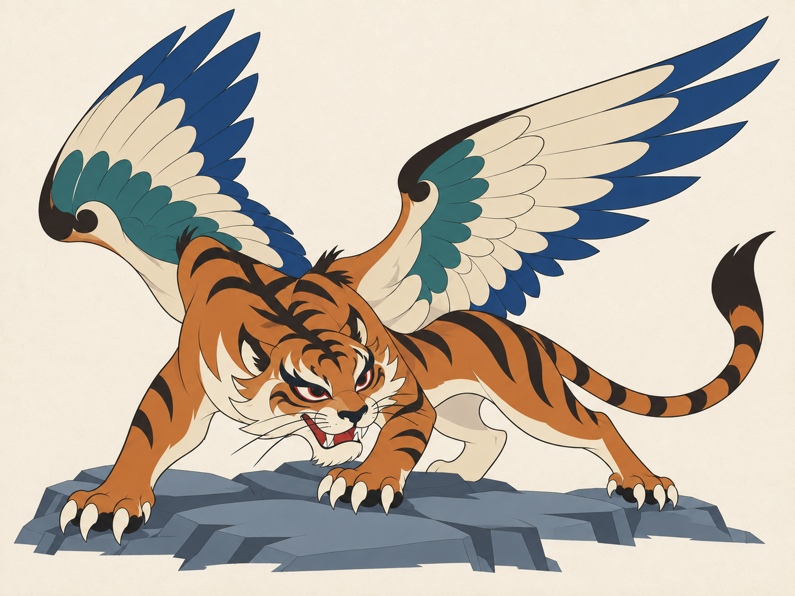
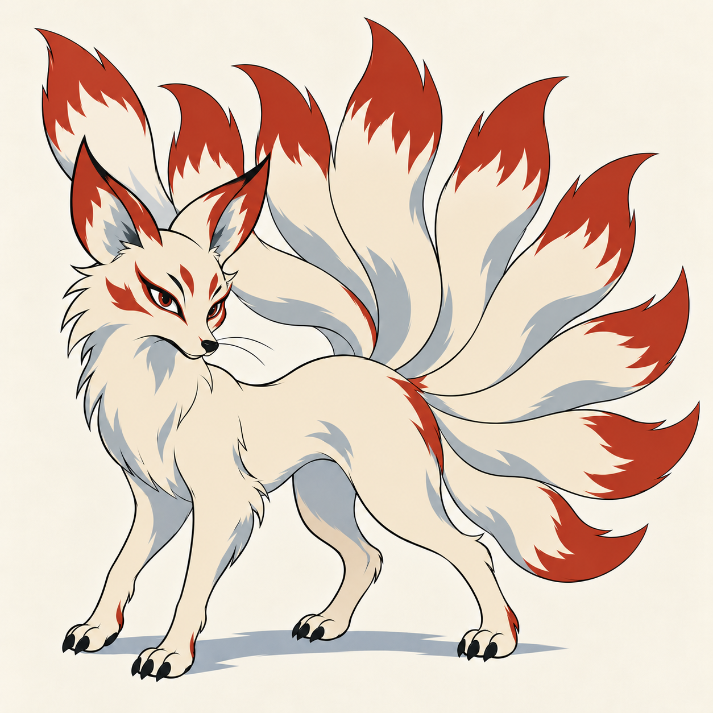
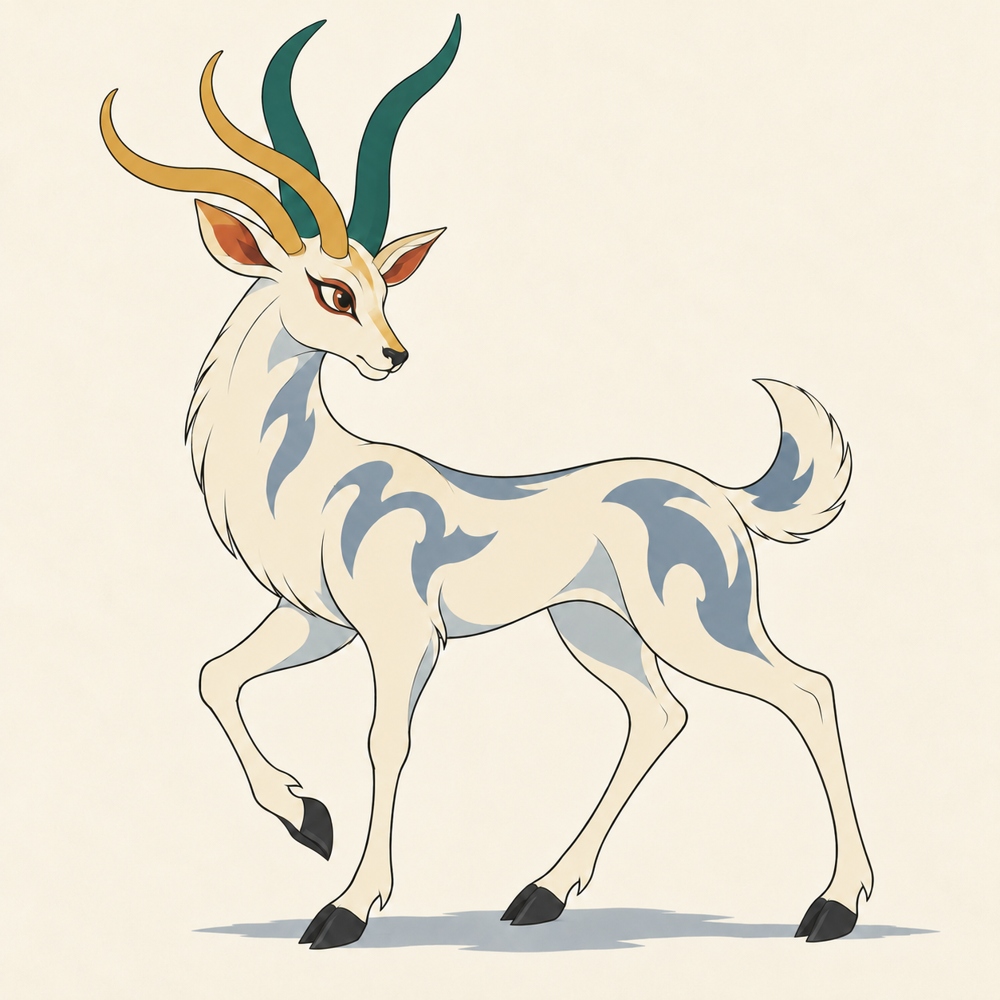
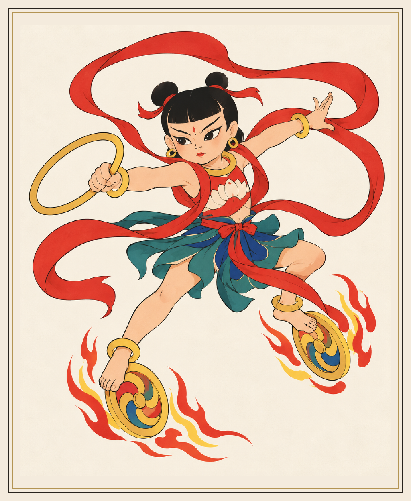
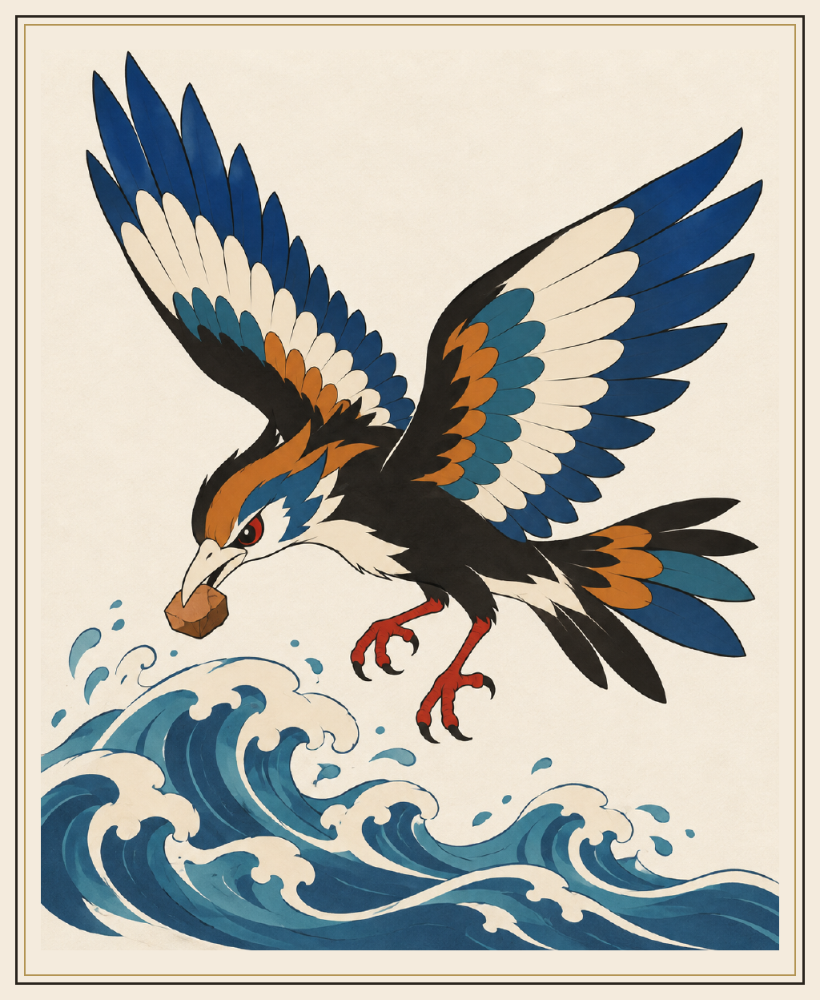
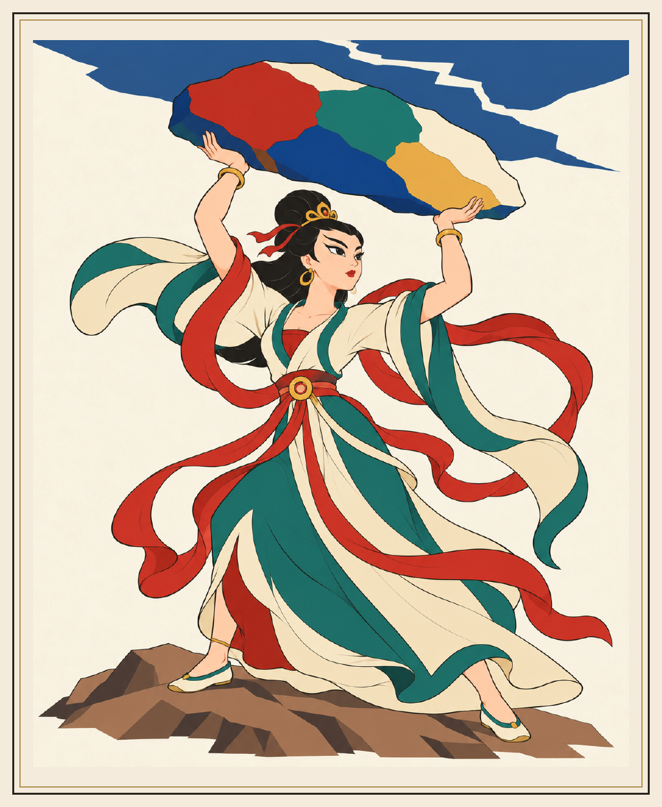
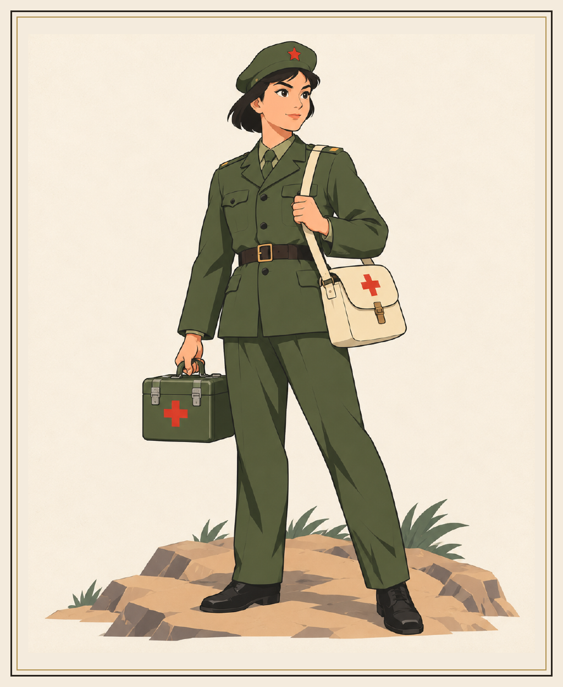
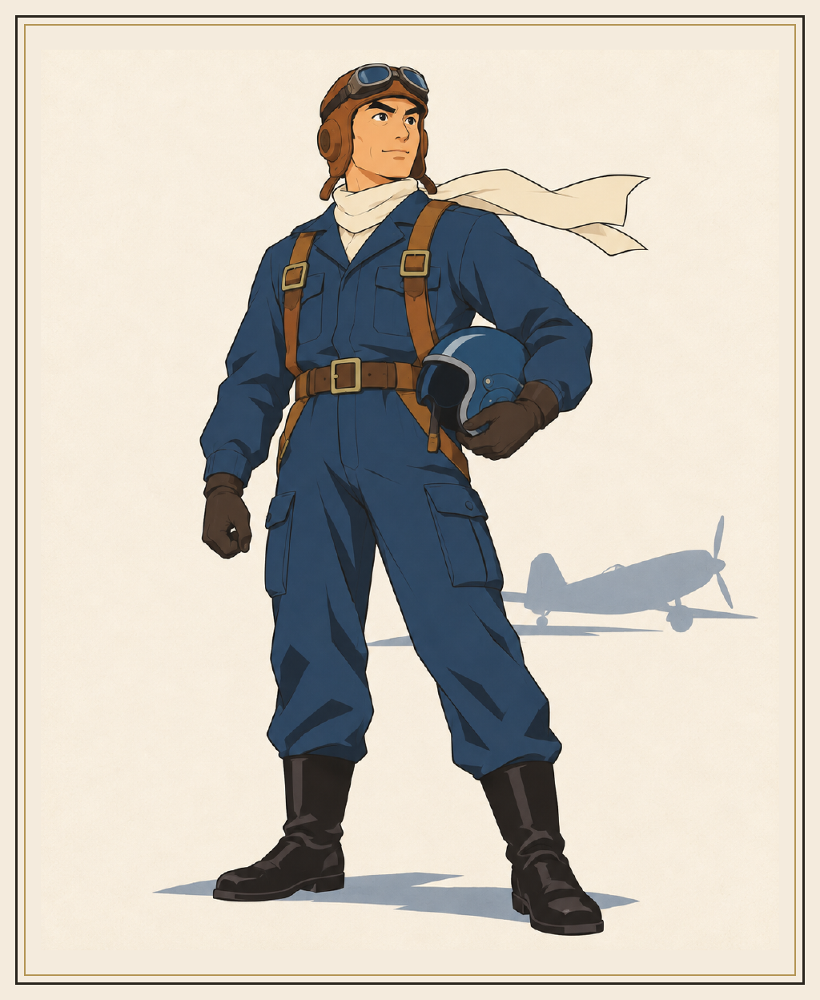
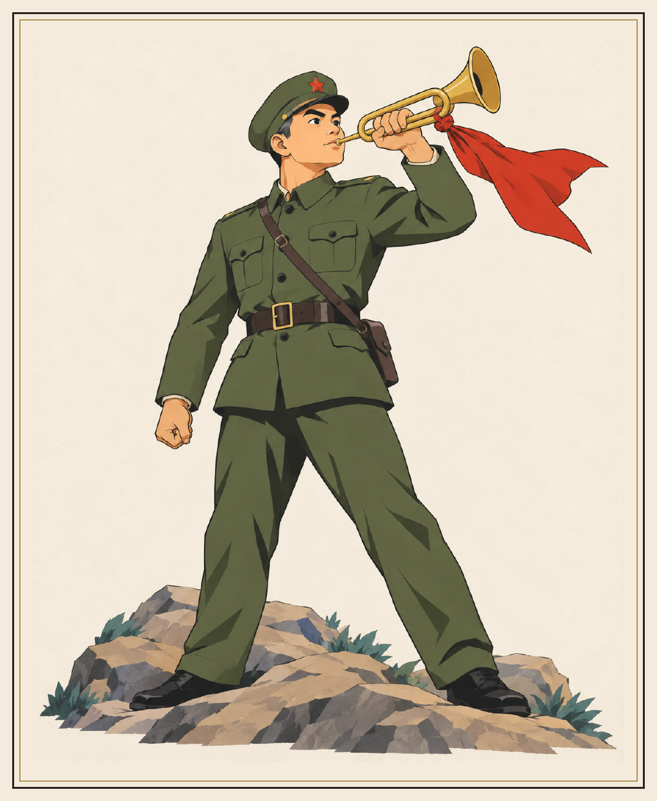

# 上美厂经典二维动画画风 Skill

**用清楚的墨线、复古矿物配色和赛璐珞平涂，生成富有性格的传统角色，并留下可复用的完整提示词。**

`shanghai-cel-animation` 面向 20 世纪中国上海美术电影经典二维手绘动画中的平涂美术方向，借鉴民间年画、戏曲造型与民间漫画的表现力。可用于神兽造型稿、神话人物、人物插画和洋画卡片，也可以只用来编写提示词。



*穷奇样张：在保持虎形、羽翼和低伏姿态的基础上，修订为更明确的平涂色块。它承担画风参考，不是其他角色必须继承的造型。*

## 已生成素材展示

以下均为本项目已生成并选用的素材。神兽、中国神话、部队洋画分别展示；各套题材独立，共享线条和上色规则。

### 山海经神兽

| 九尾狐 | 夫诸 |
| :---: | :---: |
|  |  |
| 九条尾巴形成明确剪影 | 四角白鹿，角与身体保持完整 |

### 中国神话洋画

| 哪吒 | 精卫 | 女娲补天 |
| :---: | :---: | :---: |
|  |  |  |
| 人物姿态与法器概括 | 纯鸟形，衔石填海 | 本套采用完整人形版本 |

### 部队洋画

| 军医 | 飞行员 | 战地号手 |
| :---: | :---: | :---: |
|  |  |  |
| 清楚的身份道具 | 石青蓝与象牙白配色 | 黄铜军号与朱砂红点缀 |

神话和部队示例为 1024 × 1248 的洋画正面 PNG。卡框属于本项目的成品版式，不是 Skill 的默认画风要求。主体插画通过生图获得，统一边框与导出尺寸通过后期排版完成。

本项目的神兽示例保留动物面部，不采用人头兽身；这一造型约束按具体任务设置。Skill 本身可处理人、动物与异兽，默认保留各自主体构造，不把某一种角色的身体特征套到其他角色上。

## 安装到 Codex

本仓库根目录就是完整 Skill 文件夹。将仓库保存为 `~/.codex/skills/shanghai-cel-animation`，其中必须包含 `SKILL.md`、`agents/` 和 `references/`。

首次安装可以使用：

```bash
git clone https://github.com/sudubin/shanghai-cel-animation.git ~/.codex/skills/shanghai-cel-animation
```

如果这个目录已存在，先保留自己的修改，再合并更新。安装后，在能够识别该 Skill 的 Codex 对话中使用 `$shanghai-cel-animation` 调用。

## 怎么使用

**根据参考图生成角色：**

```text
使用 $shanghai-cel-animation，根据我上传的造型参考生成穷奇。
保留虎形面孔、四足、一对羽翼与长尾；完整入画，背景简单。
采用明确墨线、有限矿物配色和赛璐珞平涂。
生成后检查身体构造与上色，并交付最终图片和完整可复用提示词。
```

**只编写提示词：**

```text
使用 $shanghai-cel-animation，为“四角白鹿夫诸”编写完整生图提示词。
清楚写出四个角、白鹿身体、温和表情与完整侧面构图。
背景为浅象牙白；只需要通用自然语言提示词，不需要生成图片。
```

**为其他生图模型复用：**

无需安装 Skill，也可以复制 [提示词库](references/prompt-library.md) 的完整模板，替换主体、动作、构图和配色。模板使用自然语言，不包含模型专属权重或命令。

## 可直接复制的画风模块

先写清楚角色的身体构造、数量特征、动作和构图，再附上这段：

```text
20世纪60至80年代中国上海美术电影经典二维手绘动画美术设定稿，
融合民间年画、戏曲造型与民间漫画的表现力。形体概括、比例适度夸张、
剪影清楚，眉眼、鼻形、口型和适合该角色的须毛突出性格。
细腻明确、有节奏的墨黑轮廓线，轻微粗细变化，外线略重、内线简洁，
主体边缘干净锐利，无墨色晕染。按角色从朱砂红、孔雀绿、石青蓝、
赭石、土黄、墨黑、象牙白及少量旧金中选择三至五个主要颜色，明确部位分配。
二维赛璐珞平涂，大面积完整色块，每部位一个均匀底色，
最多一至两层形状概括的硬边阴影。颜色清楚、干净、有秩序，表面平整哑光，
无渐变塑形、体积高光或斑驳笔触。毛发与羽毛概括为几组清楚的大形状。
简单浅色背景，大面积留白，极轻微纸纹与胶片颗粒主要留在背景，
纹理不损伤主体线条和色块，无文字与水印。
```

完整模板、穷奇范例、排除项、参考图分工和针对水彩质感的修订句见 [references/prompt-library.md](references/prompt-library.md)。

## 这套画风怎么保持稳定

| 项目 | 具体要求 |
| --- | --- |
| 造型 | 简练轮廓、适度夸张，性格通过姿态与五官表达 |
| 线条 | 连贯墨线，外轮廓略重，内部线少而准确 |
| 配色 | 从矿物色相库中选择有限主色，明确部位分配 |
| 上色 | 一个均匀底色，加零至两层边界明确的阴影 |
| 细节 | 毛羽、服饰与饰纹服从大形状，便于逐帧重画 |
| 年代感 | 轻微纸纹和颗粒以背景为主，主体保持清楚 |
| 参考图 | 分清造型参考与画风参考，避免继承无关身体部件 |

如果出图出现水彩笔触，优先修订上色，重复“均匀底色＋硬边阴影”，并保留已认可的构造与构图。如果出现构造错误，具体指出角、尾、翼或肢体数量，重新检查实际图片。

## 仓库结构

```text
shanghai-cel-animation/
├── README.md                       中文说明与素材展示
├── SKILL.md                        Skill 入口和工作规则
├── agents/openai.yaml              Codex 显示名称与默认提示
├── references/
│   ├── prompt-library.md           通用模板、范例与修订句
│   └── qiongqi-approved.png        已认可的画风样张
└── examples/
    ├── beasts/                     神兽展示图
    ├── mythology/                  中国神话洋画展示图
    └── military/                   部队洋画展示图
```

## 测试范围与视觉来源

本项目已使用内置 imagegen 生成并实际查看图片，穷奇做过平涂修订。提示词可作为其他模型的起点，尚未在其他生图模型中实测，不保证不同模型产生相同图像。

这里讨论的是经典动画中的平涂美术方向，不概括上美厂全部作品，也不覆盖水墨动画、剪纸动画或动画视频制作。

视觉研究包括《哪吒闹海》人物造型与《天书奇谭》角色表现，具体来源链接见 [提示词库的视觉研究来源](references/prompt-library.md#6-视觉研究来源)。仓库展示的是本项目生成素材，不包含第三方作品截图。
